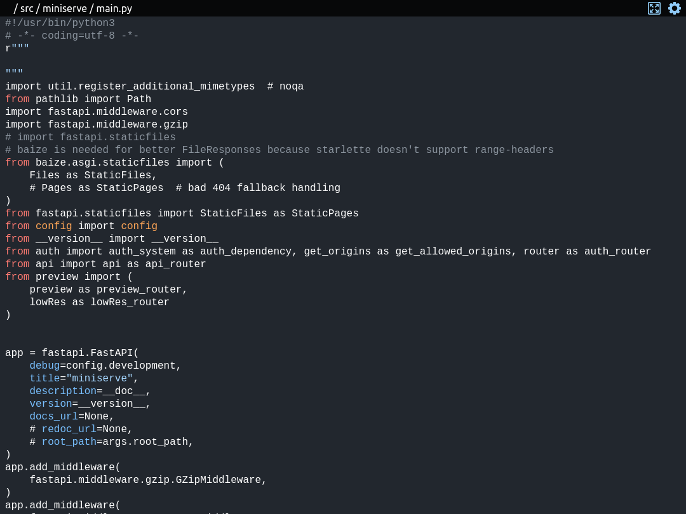

# {:style="height: 30px"} fileporter
{: .text-center }

Serve a directory in your local network for view over the browser

[getting started](getting-started/index.md){: .btn .btn-blue .fs-5 }
{: .d-flex .flex-justify-around }

After installation you also have access to the `fileporter --help` or `man fileporter` commands.

## More about fileporter

> fileporter can be used to quickly share a directory for a good read-only browser view on mobile, desktop or other devices.
> though a [password](./configuration/index.md#password) you are able to ensure that your files don't enter the wrong hands.

> fileporter also supports the deployment on a server

## Example usage

```shell
user@pc:~/path/to/folder$ fileporter
<args {'host': '0.0.0.0', 'port': 8000, 'root': '.', 'username': 'user', 'auth': None, 'worker': 8, 'root_path': '/', 'uds': None, 'logs': None, 'dotall': False, 'dependencies': False, 'cache': True}>

                                 
    █▀▀▀▀▀█ ▀▀▀  ▄▄▀  █▀▀▀▀▀█    
    █ ███ █ ▄▄▀▄▄▄  ▀ █ ███ █    
    █ ▀▀▀ █ █▀▄▄ █▄▀  █ ▀▀▀ █    
    ▀▀▀▀▀▀▀ █ ▀▄▀ ▀▄▀ ▀▀▀▀▀▀▀    
    ▀  ▄▀ ▀▀█▀██▀▄▀▄█▀▀▀██ ▄▀    
    ▄▄██▀█▀ ▀▄▀██  ▀▄▀▄██▀█▄     
    █ ▄▄▄▀▀▄▀█▄▀▀▄▀▄█▀▀▀▄▀▀█▀    
      ▀▄▄█▀▀▀   ▄  ▀ ▀ ▄▄██▄     
    ▀▀ ▀ ▀▀▀▄ ▀▀▄▀█▀█▀▀▀█▀█      
    █▀▀▀▀▀█ ▀ ▄█▀█▀ █ ▀ ██▄      
    █ ███ █ ▀   ▀█▄ ▀███▀▄███    
    █ ▀▀▀ █   █ ▄ ▄█ ▀██▄▄▄█     
    ▀▀▀▀▀▀▀ ▀  ▀ ▀▀▀  ▀   ▀▀▀    
                                      
    http://10.20.30.40:8000
```
{: .lh-0 }




[use it now](getting-started/index.md){: .btn .btn-blue .mx-auto .fs-5 }
{: .d-flex .flex-justify-around }
